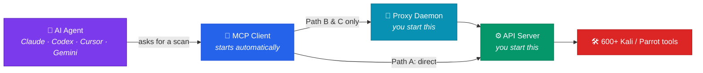

<div align="center">

# ⚡ PhantomStrike

### Run Kali &amp; Parrot security tools by just asking your AI

Ask Claude, Codex, Cursor, or Gemini to scan a host — PhantomStrike gives your agent
**every one of the 600+ tools on Kali and Parrot**, runs them for real, and hands
back the results.

<br>

[](LICENSE)
[](https://www.python.org/downloads/)
[](SECURITY.md)
[](https://modelcontextprotocol.io)

<br>

**[Quick start](#-quick-start) · [Choose your setup](#-choose-your-setup) · [Restarting](#-restarting-it-later) · [Safety](#-safety-controls) · [Troubleshooting](#-troubleshooting)**

</div>

---

> [!CAUTION]
> **Authorised testing only.** Scanning systems you don't own or have written permission to test is illegal in most countries. PhantomStrike includes a [scope file](#-safety-controls) to help you stay inside your authorisation — it's a safeguard, not a substitute for permission.

<br>

## 🚀 Quick start

The script installs the tools, sets up Python, generates your API key, **edits your AI agent's config file for you**, and writes a start script. You never hand-edit JSON.

Pick the line that matches where you're sitting.

<br>

### 🐉 A · You're working inside Kali or Parrot

Everything on one machine. Run this in a terminal there:

```bash
curl -sSL https://raw.githubusercontent.com/Red-Snow/phantomstrike/main/setup.sh | bash
```

Restart your AI agent. Done — there's no server or proxy to start.

<br>

### 💻 B · Your AI runs on a Mac or Windows PC, tools on a Kali / Parrot VM

This is the setup for **Claude Desktop + a VM in VMware Fusion, Parallels, VirtualBox, or WSL**.

> [!IMPORTANT]
> **Start on your Mac / PC, not in the VM.** The key is generated on your computer and pasted *into* the VM. Host→VM paste works reliably; VM→host often doesn't — so nothing ever has to be copied out of the VM.

**Step 1 — on your Mac / Windows PC:**

```bash
curl -sSL https://raw.githubusercontent.com/Red-Snow/phantomstrike/main/setup.sh | bash -s -- --client
```

```powershell
irm https://raw.githubusercontent.com/Red-Snow/phantomstrike/main/setup.ps1 | iex
```

It asks for your VM's IP address, then prints **one line** that already contains your key.

**Step 2 — paste that line into your Kali / Parrot VM.** It looks like this:

```bash
curl -sSL https://raw.githubusercontent.com/Red-Snow/phantomstrike/main/setup.sh | bash -s -- --api-key <your-key>
```

**Step 3 — start both halves and leave both windows open:**

```bash
# 🐉 in the VM
cd ~/phantomstrike && ./start.sh server
```

```bash
# 💻 on your Mac / PC
cd ~/phantomstrike && ./start.sh proxy
```

**Step 4 — fully quit your AI agent and reopen it.** On a Mac that's <kbd>⌘</kbd>+<kbd>Q</kbd>; closing the window isn't enough.

<details>
<summary><b>Don't know your VM's IP?</b></summary>

<br>

Run this **in the VM** and look for the `192.168.x.x` or `10.x.x.x` address:

```bash
ip -4 addr | grep inet
# inet 192.168.72.128/24  →  your IP is 192.168.72.128
```

If your computer still can't reach it, open the port in the VM: `sudo ufw allow 8443`

</details>

<br>

> [!TIP]
> **Safe to run again.** Re-running keeps your existing key and skips anything already done. If a step fails, fix the cause and run it again — you never need to start over.

Then ask your agent:

> *"List all available PhantomStrike tools"*

<details>
<summary><b>What does the script actually do?</b></summary>

<br>

1. Detects your distro and package manager — Kali, Parrot, Debian, Ubuntu, Fedora, Arch, macOS, WSL2
2. Installs the security tools (`nmap`, `nuclei`, `sqlmap`, `ffuf`, and the rest)
3. Creates a Python virtual environment and installs PhantomStrike
4. **Generates your API key** and saves it to `.env` — which is gitignored, so it can never be committed
5. **Writes `start.sh`** (or `start.ps1`) so restarting later is one command
6. **Edits your agent's config file directly** — Claude Desktop, Cursor, Codex, Gemini CLI. It reads the existing file, adds one entry, and writes it back, so **other MCP servers you already had are kept**. A timestamped backup is made first, and a config it can't parse is left alone rather than guessed at.

It only touches agents you actually have installed. It never overwrites your work and it never commits your key.

</details>

<details>
<summary><b>Where did it put the agent config?</b></summary>

<br>

The script prints the full path when it writes one. For reference:

| Agent | macOS | Windows | Linux |
|:--|:--|:--|:--|
| Claude Desktop | `~/Library/Application Support/Claude/claude_desktop_config.json` | `%APPDATA%\Claude\claude_desktop_config.json` | `~/.config/Claude/claude_desktop_config.json` |
| Cursor | `~/.cursor/mcp.json` | `%USERPROFILE%\.cursor\mcp.json` | `~/.cursor/mcp.json` |
| Gemini CLI | `~/.gemini/settings.json` | `%USERPROFILE%\.gemini\settings.json` | `~/.gemini/settings.json` |
| Codex CLI | `~/.codex/config.toml` | `%USERPROFILE%\.codex\config.toml` | `~/.codex/config.toml` |

If the script reported **"No AI agent found"**, open the app once so it creates its settings folder, then run the script again.

</details>

<br>

## 🗺️ Choose your setup

**The setup script above covers Paths A and B already.** This section is for doing it by hand, or for Docker. Pick **one** path — they're self-contained, and commands from one path won't work in another.

<div align="center">

| | 🐉 **A · All-in-one** | 🔗 **B · Split** | 🐳 **C · Docker** |
|:--|:--:|:--:|:--:|
| **Best for** | You live in Kali / Parrot | Claude Desktop users | Avoiding VMs |
| **AI runs on** | Kali / Parrot | Your computer | Your computer |
| **Tools run on** | Kali / Parrot | Kali / Parrot VM | Container |
| **Claude Desktop** | ❌ no Linux build | ✅ | ✅ |
| **Things to keep running** | **1** | **3** | **3** |
| **By hand** | 🟢 Easiest | 🟡 Medium | 🟡 Medium |
| **With the script** | 🟢 One command | 🟢 Two commands | — |

</div>

> [!NOTE]
> **Not sure?** Live in Kali or Parrot → **Path A**. Mac or Windows with a Kali / Parrot VM → **Path B** (use [Quick start B](#-b--your-ai-runs-on-a-mac-or-windows-pc-tools-on-a-kali--parrot-vm) — the script does the awkward parts). No VM and you'd rather not make one → **Path C**.

<br>

## 🧩 What runs where

Most setup confusion comes from losing track of which machine a command belongs to. Every command below is labelled **🐉 Run in Kali / Parrot** or **💻 Run on your computer**.



| Piece | What it is | You start it? | Paths |
|:--|:--|:--:|:--:|
| ⚙️ **API server** | Runs the actual security tools | ✅ Yes | B · C |
| 🌉 **Proxy daemon** | Bridges Claude Desktop's network sandbox | ✅ Yes | B · C |
| 🔌 **MCP client** | Your agent launches it for you | ❌ Never | A · B · C |

> [!IMPORTANT]
> **Path A has no server and no proxy.** The agent runs tools directly, which is why it's the simplest — one thing to keep running instead of three.

<br>

## 📦 Manual setup

<details>
<summary><h3>🐉 &nbsp;Path A — Everything inside Kali / Parrot</h3></summary>

<br>

> [!NOTE]
> No API key needed on this path — nothing talks over HTTP.

### 1️⃣ Install the security tools

> **🐉 Run in Kali / Parrot**

```bash
sudo apt update && sudo apt full-upgrade -y
sudo apt install -y nmap masscan amass hydra ffuf gobuster nikto nuclei sqlmap subfinder
```

<details>
<summary>Don't have Kali or Parrot yet?</summary>

<br>

**Windows (WSL2)** — PowerShell as Administrator:

```powershell
wsl --install
wsl --set-default-version 2
wsl --install -d kali-linux
kali
```

**macOS or any host** — grab a VM image and import it into VMware Fusion or VirtualBox:
[Kali](https://www.kali.org/get-kali/#kali-virtual-machines) · [Parrot](https://parrotsec.org/download/). Give it 4 GB RAM, 40 GB disk, 2 CPUs.

</details>

### 2️⃣ Install PhantomStrike

> **🐉 Run in Kali / Parrot**

```bash
git clone https://github.com/Red-Snow/phantomstrike.git
cd phantomstrike
python3 -m venv .venv
source .venv/bin/activate
pip install -e .

pwd    # note this path — you need it in step 4
```

### 3️⃣ Install an AI agent

> **🐉 Run in Kali / Parrot**

> [!WARNING]
> Claude Desktop has **no Linux build**. On this path use Cursor, Codex, or Gemini CLI.

```bash
# Cursor
curl https://cursor.com/install -fsS | sh
```

```bash
# Gemini CLI
curl -fsSL https://deb.nodesource.com/setup_20.x | sudo -E bash -
sudo apt install -y nodejs
npm install -g @google/gemini-cli
gemini          # sign in when prompted
```

```bash
# Codex CLI
npm install -g @openai/codex
codex           # sign in when prompted
```

### 4️⃣ Connect the agent

> **🐉 Run in Kali / Parrot**

PhantomStrike is a standard MCP server, so **any MCP-compatible agent works**.
Add it to whichever you installed — **replacing the path with your own from step 2**.

<details open>
<summary><b>Cursor · Gemini CLI · Claude Desktop · most others (JSON)</b></summary>

<br>

| Agent | Config file |
|:--|:--|
| Cursor | `~/.cursor/mcp.json` |
| Gemini CLI | `~/.gemini/settings.json` |
| Claude Desktop | `~/.config/Claude/claude_desktop_config.json` |

```json
{
  "mcpServers": {
    "phantomstrike": {
      "command": "/root/phantomstrike/.venv/bin/phantomstrike-mcp",
      "args": ["--mode", "local"]
    }
  }
}
```

</details>

<details>
<summary><b>Codex CLI (TOML)</b></summary>

<br>

Codex uses TOML, not JSON. Edit `~/.codex/config.toml`:

```toml
[mcp_servers.phantomstrike]
command = "/root/phantomstrike/.venv/bin/phantomstrike-mcp"
args = ["--mode", "local"]
```

A project-scoped `.codex/config.toml` works too, for trusted projects.

</details>

> [!TIP]
> **Using something else?** Any client that speaks MCP over stdio can run
> `phantomstrike-mcp --mode local`. Point your agent's MCP config at that
> binary and it will discover the tools automatically.

Restart your agent so it reads the config.

### 5️⃣ Check it works

Ask your agent: *"List all available PhantomStrike tools"*

### 🔄 Restarting later

> [!TIP]
> **Nothing to do.** Open your AI agent — it starts PhantomStrike for you. Never repeat steps 1–4.

</details>

<details>
<summary><h3>🔗 &nbsp;Path B — AI on your computer, tools on a Kali / Parrot VM</h3></summary>

<br>

Three things stay running: the **API server** on the Kali / Parrot box, the **proxy daemon** on your computer, and your **AI agent**.

> [!IMPORTANT]
> **The order of these steps matters.** You generate the key on **your computer** and carry it *into* the VM. Doing it the other way round means copying text out of a VM, and guest→host clipboard is exactly the direction that tends not to work in VMware Fusion and VirtualBox.

### 1️⃣ Generate the key on your computer

> **💻 Run on your computer**

```bash
python3 -c "import secrets; print(secrets.token_urlsafe(32))"
```

Keep that terminal visible — you'll paste this value twice, and both times you're pasting *from* your computer.

### 2️⃣ Install and start the API server

> **🐉 Run in Kali / Parrot**

```bash
sudo apt update
sudo apt install -y nmap masscan amass hydra ffuf gobuster nikto nuclei sqlmap subfinder

git clone https://github.com/Red-Snow/phantomstrike.git
cd phantomstrike
python3 -m venv .venv
source .venv/bin/activate
pip install -e .
```

Paste the key from step 1 here — **the server will not start without one**:

```bash
export PHANTOMSTRIKE_API_KEYS="paste-the-key-from-step-1"
phantomstrike --host 0.0.0.0 --port 8443
```

**Leave this terminal open.** In a second terminal on that box, find your IP:

```bash
ip -4 addr | grep inet
# inet 192.168.72.128/24  →  your IP is 192.168.72.128
```

If your computer can't reach it later: `sudo ufw allow 8443`

> [!TIP]
> You only need to read the IP off the screen, not copy it — it's four short numbers.

### 3️⃣ Install PhantomStrike on your computer

> **💻 Run on your computer**

```bash
git clone https://github.com/Red-Snow/phantomstrike.git
cd phantomstrike
python3 -m venv .venv
source .venv/bin/activate          # macOS/Linux
# .venv\Scripts\Activate.ps1       # Windows PowerShell
pip install -e .
```

### 4️⃣ Start the proxy daemon

> **💻 Run on your computer — new terminal**

> [!NOTE]
> **Why this exists:** Claude Desktop blocks MCP processes from opening network connections, even to your own machine. The proxy relays over a Unix socket, which the sandbox permits.

```bash
cd phantomstrike
source .venv/bin/activate

export PHANTOMSTRIKE_API_KEY="the-same-key-from-step-1"
python3 proxy_daemon.py --remote http://192.168.72.128:8443
```

You should see:

```text
🔌 PhantomStrike Proxy Daemon running
   Socket: /tmp/phantomstrike_proxy.sock
   Auth:   API key loaded          ← must say this
```

> [!WARNING]
> If it says **`NO KEY SET`**, every tool call will fail with 401. Set the variable and restart it.

**Leave this terminal open.**

### 5️⃣ Connect Claude Desktop

> **💻 Run on your computer**

> [!TIP]
> **You can skip the hand-editing.** Running `./setup.sh --client` on your computer writes this entry for you, keeping any MCP servers you already have. Use it even if you did the rest of this path manually.

| OS | Config file |
|:--|:--|
| macOS | `~/Library/Application Support/Claude/claude_desktop_config.json` |
| Windows | `%APPDATA%\Claude\claude_desktop_config.json` |
| Linux | `~/.config/Claude/claude_desktop_config.json` |

If the file doesn't exist yet, create it with exactly this. If it already exists, add only the `"phantomstrike"` block inside the `"mcpServers"` you already have — don't replace the whole file.

```json
{
  "mcpServers": {
    "phantomstrike": {
      "command": "/full/path/to/phantomstrike/.venv/bin/phantomstrike-mcp",
      "args": ["--mode", "remote"]
    }
  }
}
```

> [!WARNING]
> `command` must be an **absolute path** — `~` and relative paths don't work here. Get it with `echo "$PWD/.venv/bin/phantomstrike-mcp"` from your clone.

Then **quit Claude Desktop completely** (<kbd>⌘</kbd>+<kbd>Q</kbd> on a Mac — closing the window isn't enough) and reopen it.

### 6️⃣ Check it works

Ask Claude: *"List all available PhantomStrike tools"*

### 🔄 Restarting later

See [Restarting it later](#-restarting-it-later).

</details>

<details>
<summary><h3>🐳 &nbsp;Path C — Docker</h3></summary>

<br>

Three things stay running: the **container**, the **proxy daemon**, and your **AI agent**.

### 1️⃣ Install Docker

> **💻 Run on your computer**

Install [Docker Desktop](https://www.docker.com/products/docker-desktop), then check it:

```bash
docker --version
```

### 2️⃣ Start the container

> **💻 Run on your computer**

```bash
git clone https://github.com/Red-Snow/phantomstrike.git
cd phantomstrike
```

Generate your API key — the server won't start without one:

```bash
python3 -c "import secrets; print(secrets.token_urlsafe(32))"
```

Save it where Docker Compose picks it up automatically:

```bash
echo 'PHANTOMSTRIKE_API_KEYS=paste-your-key-here' >> .env
docker compose up -d
```

First build takes about 3 minutes.

```bash
curl http://localhost:8443/health
# {"status":"healthy", ...}
```

### 3️⃣ Install the MCP client

> **💻 Run on your computer — same folder**

```bash
python3 -m venv .venv
source .venv/bin/activate          # macOS/Linux
# .venv\Scripts\activate           # Windows PowerShell
pip install -e .
```

### 4️⃣ Start the proxy daemon

> **💻 Run on your computer — new terminal**

> [!NOTE]
> Needed **even though the container is on localhost** — Claude Desktop's sandbox blocks localhost TCP too.

```bash
cd phantomstrike
source .venv/bin/activate

export PHANTOMSTRIKE_API_KEY="the-same-key-from-step-2"
python3 proxy_daemon.py --remote http://localhost:8443
```

Confirm it prints `Auth: API key loaded`. **Leave this terminal open.**

### 5️⃣ Connect Claude Desktop

> **💻 Run on your computer**

| OS | Config file |
|:--|:--|
| macOS | `~/Library/Application Support/Claude/claude_desktop_config.json` |
| Windows | `%APPDATA%\Claude\claude_desktop_config.json` |

```json
{
  "mcpServers": {
    "phantomstrike": {
      "command": "/full/path/to/phantomstrike/.venv/bin/phantomstrike-mcp",
      "args": ["--mode", "remote"]
    }
  }
}
```

Quit Claude Desktop completely and reopen it.

### 6️⃣ Check it works

Ask Claude: *"List all available PhantomStrike tools"*

### 🔄 Restarting later

See [Restarting it later](#-restarting-it-later). Container commands:

```bash
docker compose up -d           # start
docker compose down            # stop
docker compose logs -f         # watch logs
docker compose up -d --build   # rebuild after code changes
```

</details>

<br>

## 🔄 Restarting it later

> [!TIP]
> **You never need to reinstall.** If you used the setup script, restarting is one command.

### If you used the setup script

`start.sh` knows which half it was installed as, so plain `./start.sh` does the right thing on each machine. Be explicit if you'd rather not think about it.

#### 🐧 Linux / macOS

```bash
cd ~/phantomstrike
./start.sh status     # is the server up and reachable?
./start.sh server     # 🐉 run this in the VM
./start.sh proxy      # 💻 run this on your computer
```

#### 🪟 Windows

```powershell
cd $env:USERPROFILE\phantomstrike
.\start.ps1 status
.\start.ps1 server
.\start.ps1 proxy
```

<br>

**Path B, after a reboot, in order:**

| | Where | Command |
|:--|:--|:--|
| 1 | 🐉 Kali / Parrot VM | `cd ~/phantomstrike && ./start.sh server` |
| 2 | 💻 Your computer | `cd ~/phantomstrike && ./start.sh proxy` |
| 3 | 💻 Your computer | Open your AI agent |

Nothing to reinstall and no keys to re-enter — they're already in `.env` on both machines.

### If you set up manually

| Path | After a reboot |
|:--|:--|
| 🐉 **A** | **Nothing.** Just open your AI agent. |
| 🔗 **B** | 1. 🐉 Kali/Parrot: `./start.sh server` &nbsp; 2. 💻 `./start.sh proxy` &nbsp; 3. Open Claude Desktop |
| 🐳 **C** | 1. 💻 `docker compose up -d` &nbsp; 2. 💻 `./start.sh proxy` &nbsp; 3. Open Claude Desktop |

> [!IMPORTANT]
> Terminals running the server or proxy must **stay open** while you work. Closing one stops that piece.

<br>

## 🛡️ Safety controls

Three settings decide how much this tool can do.

| Setting | Default | What it does |
|:--|:--:|:--|
| `PHANTOMSTRIKE_API_KEYS` | 🔴 **required** | Server refuses to start without it. Paths B & C. |
| `PHANTOMSTRIKE_ENGAGEMENT` | ⚪ unset | Scope file. Targets outside it are refused. |
| `PHANTOMSTRIKE_ALLOW_RAW_SHELL` | 🟢 `true` | Universal access to all 600+ tools. Set `false` for a plugins-only lockdown. |

### Limiting what can be scanned

Without a scope file, PhantomStrike scans whatever it's asked to. Copy `engagement.example.yaml` → `engagement.yaml`:

```yaml
client: Example Corp
in_scope:
  - 10.10.0.0/16
  - "*.staging.example.com"
out_of_scope:
  - 10.10.99.0/24        # wins over in_scope
```

```bash
export PHANTOMSTRIKE_ENGAGEMENT=./engagement.yaml
```

> [!IMPORTANT]
> **Why this is enforced below the agent.** An AI agent decides what to run next based on tool output — and tool output comes from the host being scanned. A target can plant text in a service banner or HTTP response aimed at steering the agent. Scope is checked in the execution path, so a redirected agent still can't reach a host outside your engagement. Full threat model in [SECURITY.md](SECURITY.md).

<br>

## 🩺 Troubleshooting

<div align="center">

| 😖 Symptom | 🔍 Cause | ✅ Fix |
|:--|:--|:--|
| **Can't paste the key out of the VM** | Guest→host clipboard is unreliable | You shouldn't have to. Run `./setup.sh --client` on your **computer** first and paste its one line *into* the VM |
| **Agent shows no PhantomStrike tools** | Config not loaded | Re-run `./setup.sh --client` — it edits the config for you — then **fully quit** the agent (<kbd>⌘</kbd>+<kbd>Q</kbd>) and reopen |
| **"No AI agent found"** during setup | App installed but never launched | Open the app once so it creates its settings folder, then re-run the script |
| **Everything returns 401** | Server key ≠ client key | Re-run `./setup.sh --client` on your computer and paste its line into the VM again. It replaces the VM's old key |
| `no API keys are configured` | Working as designed | `export PHANTOMSTRIKE_API_KEYS="<key>"`, or run `./setup.sh` |
| Proxy says `Auth: NO KEY SET` | Not exported in that terminal | Use `./start.sh proxy`, which loads `.env` for you |
| `./start.sh status` says **not reachable** | Server not started, wrong IP, or firewall | Start `./start.sh server` in the VM · recheck `ip -4 addr \| grep inet` · `sudo ufw allow 8443` |
| `kali_shell` missing | Explicitly turned off | Remove `PHANTOMSTRIKE_ALLOW_RAW_SHELL=false` from `.env` |
| Won't start: "unauthenticated root shell" | Auth off + shell on + public bind | Enable auth, or bind to `127.0.0.1` |
| `out of scope` refusals | Engagement file active | Add target to `in_scope`, or unset the variable |
| `binary not found` | Tool not installed | `sudo apt install -y <tool>` (in the VM) |

</div>

<details>
<summary><b>Checking the pairing by hand</b></summary>

<br>

Both machines must hold the **same** key. On each, print it:

```bash
# 🐉 in the VM
grep PHANTOMSTRIKE_API_KEYS ~/phantomstrike/.env

# 💻 on your computer
grep PHANTOMSTRIKE_API_KEY ~/phantomstrike/.env
```

Compare the last few characters. If they differ, re-run `./setup.sh --client` on your computer and paste its line into the VM — that resets the VM to match.

Then check the server answers your computer at all:

```bash
# 💻 on your computer
curl http://<vm-ip>:8443/health
# {"status":"healthy", ...}
```

No response means it's a network problem (IP, firewall, VM network mode), not a key problem.

</details>

**Still stuck?** [Open an issue](https://github.com/Red-Snow/phantomstrike/issues) with your path (A/B/C), the command, and the output.

<br>

## 🧰 Available tools

Thirteen tools ship with dedicated parsers, so their results come back structured rather than as raw text:

<div align="center">

| Category | Tools |
|:--|:--|
| 🌐 **Network** | `nmap` · `masscan` · `rustscan` |
| 🕸️ **Web** | `nuclei` · `nikto` · `ffuf` · `gobuster` · `sqlmap` |
| 🔍 **OSINT** | `amass` · `subfinder` |
| ☁️ **Cloud** | `trivy` |
| 🔑 **Credentials** | `hydra` |

</div>

### 🔓 Everything else

**`kali_shell` gives your agent the other 600+.** `wpscan`, `dirb`, `enum4linux`,
`crackmapexec`, `john`, `responder`, `metasploit` — anything installed on the box,
plus `grep`, `pip`, and any script you've written yourself. Works the same on
Kali and Parrot.

**It is on by default.** That is the point of the framework: your agent gets the
whole distribution, not a curated subset.

> [!IMPORTANT]
> What keeps this safe is **authentication**, not switching the feature off. The
> API key and the cross-origin guard mean the shell answers only to you. See
> [Safety controls](#-safety-controls) and [SECURITY.md](SECURITY.md).

<br>

## 💬 Try asking

> *"Scan 10.10.0.5 for open ports and tell me what's exposed"*
>
> *"Run nuclei against https://staging.example.com and summarise anything high severity"*
>
> *"Use wpscan on this WordPress site, then enum4linux the file server"*

<br>

## 🤝 Contributing

Adding a tool means writing one plugin class — see [CONTRIBUTING.md](CONTRIBUTING.md).

Found a security issue? Please report it privately via [SECURITY.md](SECURITY.md) rather than opening an issue.

<br>

---

<div align="center">

**[⬆ Back to top](#-phantomstrike)**

Released under the [MIT License](LICENSE) · Built by [Red-Snow](https://github.com/Red-Snow)

</div>
