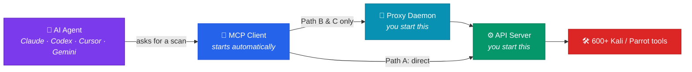

<div align="center">

# ⚡ PhantomStrike

### Run Kali &amp; Parrot security tools by just asking your AI

Ask Claude, Codex, Cursor, or Gemini to scan a host — PhantomStrike gives your agent
**every one of the 600+ tools on Kali and Parrot**, runs them for real, and hands
back the results.

<br>

[](LICENSE)
[](https://www.python.org/downloads/)
[](SECURITY.md)
[](https://modelcontextprotocol.io)

<br>

**[Quick start](#-quick-start) · [Choose your setup](#-choose-your-setup) · [Restarting](#-restarting-it-later) · [Safety](#-safety-controls) · [Troubleshooting](#-troubleshooting)**

</div>

---

> [!CAUTION]
> **Authorised testing only.** Scanning systems you don't own or have written permission to test is illegal in most countries. PhantomStrike includes a [scope file](#-safety-controls) to help you stay inside your authorisation — it's a safeguard, not a substitute for permission.

<br>

## 🚀 Quick start

One command. It installs the tools, sets up Python, generates your API key, configures your AI agent, and writes a start script.

#### 🐧 Linux · Kali · Parrot · macOS

```bash
curl -sSL https://raw.githubusercontent.com/Red-Snow/phantomstrike/main/setup.sh | bash
```

#### 🪟 Windows (PowerShell)

```powershell
irm https://raw.githubusercontent.com/Red-Snow/phantomstrike/main/setup.ps1 | iex
```

> [!TIP]
> **Safe to run again.** Re-running keeps your existing key and skips anything already done. If a step fails, fix the cause and run it again — you never need to start over.

Then restart your AI agent and ask it:

> *"List all available PhantomStrike tools"*

<details>
<summary><b>What does the script actually do?</b></summary>

<br>

1. Detects your distro and package manager — Kali, Parrot, Debian, Ubuntu, Fedora, Arch, macOS, WSL2
2. Installs the security tools (`nmap`, `nuclei`, `sqlmap`, `ffuf`, and the rest)
3. Creates a Python virtual environment and installs PhantomStrike
4. **Generates your API key** and saves it to `.env` — which is gitignored, so it can never be committed
5. **Writes `start.sh`** so restarting later is one command
6. Configures Cursor / Codex / Gemini CLI / Claude Desktop — only the ones you actually have installed, and it backs up any existing config rather than overwriting other MCP servers

It never overwrites your work and it never commits your key.

</details>

<br>

## 🗺️ Choose your setup

Prefer to do it by hand, or need Claude Desktop? Pick **one** path. They're self-contained — commands from one path won't work in another.

<div align="center">

| | 🐉 **A · All-in-one** | 🔗 **B · Split** | 🐳 **C · Docker** |
|:--|:--:|:--:|:--:|
| **Best for** | You live in Kali / Parrot | Claude Desktop users | Avoiding VMs |
| **AI runs on** | Kali / Parrot | Your computer | Your computer |
| **Tools run on** | Kali / Parrot | Kali / Parrot VM | Container |
| **Claude Desktop** | ❌ no Linux build | ✅ | ✅ |
| **Things to keep running** | **1** | **3** | **3** |
| **Difficulty** | 🟢 Easiest | 🔴 Hardest | 🟡 Medium |

</div>

> [!NOTE]
> **Not sure?** Live in Kali or Parrot → **Path A**. On macOS or Windows and want Claude Desktop → **Path C**.

<br>

## 🧩 What runs where

Most setup confusion comes from losing track of which machine a command belongs to. Every command below is labelled **🐉 Run in Kali / Parrot** or **💻 Run on your computer**.



| Piece | What it is | You start it? | Paths |
|:--|:--|:--:|:--:|
| ⚙️ **API server** | Runs the actual security tools | ✅ Yes | B · C |
| 🌉 **Proxy daemon** | Bridges Claude Desktop's network sandbox | ✅ Yes | B · C |
| 🔌 **MCP client** | Your agent launches it for you | ❌ Never | A · B · C |

> [!IMPORTANT]
> **Path A has no server and no proxy.** The agent runs tools directly, which is why it's the simplest — one thing to keep running instead of three.

<br>

## 📦 Manual setup

<details>
<summary><h3>🐉 &nbsp;Path A — Everything inside Kali / Parrot</h3></summary>

<br>

> [!NOTE]
> No API key needed on this path — nothing talks over HTTP.

### 1️⃣ Install the security tools

> **🐉 Run in Kali / Parrot**

```bash
sudo apt update && sudo apt full-upgrade -y
sudo apt install -y nmap masscan amass hydra ffuf gobuster nikto nuclei sqlmap subfinder
```

<details>
<summary>Don't have Kali or Parrot yet?</summary>

<br>

**Windows (WSL2)** — PowerShell as Administrator:

```powershell
wsl --install
wsl --set-default-version 2
wsl --install -d kali-linux
kali
```

**macOS or any host** — grab a VM image and import it into VMware Fusion or VirtualBox:
[Kali](https://www.kali.org/get-kali/#kali-virtual-machines) · [Parrot](https://parrotsec.org/download/). Give it 4 GB RAM, 40 GB disk, 2 CPUs.

</details>

### 2️⃣ Install PhantomStrike

> **🐉 Run in Kali / Parrot**

```bash
git clone https://github.com/Red-Snow/phantomstrike.git
cd phantomstrike
python3 -m venv .venv
source .venv/bin/activate
pip install -e .

pwd    # note this path — you need it in step 4
```

### 3️⃣ Install an AI agent

> **🐉 Run in Kali / Parrot**

> [!WARNING]
> Claude Desktop has **no Linux build**. On this path use Cursor, Codex, or Gemini CLI.

```bash
# Cursor
curl https://cursor.com/install -fsS | sh
```

```bash
# Gemini CLI
curl -fsSL https://deb.nodesource.com/setup_20.x | sudo -E bash -
sudo apt install -y nodejs
npm install -g @google/gemini-cli
gemini          # sign in when prompted
```

```bash
# Codex CLI
npm install -g @openai/codex
codex           # sign in when prompted
```

### 4️⃣ Connect the agent

> **🐉 Run in Kali / Parrot**

PhantomStrike is a standard MCP server, so **any MCP-compatible agent works**.
Add it to whichever you installed — **replacing the path with your own from step 2**.

<details open>
<summary><b>Cursor · Gemini CLI · Claude Desktop · most others (JSON)</b></summary>

<br>

| Agent | Config file |
|:--|:--|
| Cursor | `~/.cursor/mcp.json` |
| Gemini CLI | `~/.gemini/settings.json` |
| Claude Desktop | `~/.config/Claude/claude_desktop_config.json` |

```json
{
  "mcpServers": {
    "phantomstrike": {
      "command": "/root/phantomstrike/.venv/bin/phantomstrike-mcp",
      "args": ["--mode", "local"]
    }
  }
}
```

</details>

<details>
<summary><b>Codex CLI (TOML)</b></summary>

<br>

Codex uses TOML, not JSON. Edit `~/.codex/config.toml`:

```toml
[mcp_servers.phantomstrike]
command = "/root/phantomstrike/.venv/bin/phantomstrike-mcp"
args = ["--mode", "local"]
```

A project-scoped `.codex/config.toml` works too, for trusted projects.

</details>

> [!TIP]
> **Using something else?** Any client that speaks MCP over stdio can run
> `phantomstrike-mcp --mode local`. Point your agent's MCP config at that
> binary and it will discover the tools automatically.

Restart your agent so it reads the config.

### 5️⃣ Check it works

Ask your agent: *"List all available PhantomStrike tools"*

### 🔄 Restarting later

> [!TIP]
> **Nothing to do.** Open your AI agent — it starts PhantomStrike for you. Never repeat steps 1–4.

</details>

<details>
<summary><h3>🔗 &nbsp;Path B — AI on your computer, tools on a Kali / Parrot VM</h3></summary>

<br>

Three things stay running: the **API server** on the Kali / Parrot box, the **proxy daemon** on your computer, and your **AI agent**.

### 1️⃣ Install and start the API server

> **🐉 Run in Kali / Parrot**

```bash
sudo apt update
sudo apt install -y nmap masscan amass hydra ffuf gobuster nikto nuclei sqlmap subfinder

git clone https://github.com/Red-Snow/phantomstrike.git
cd phantomstrike
python3 -m venv .venv
source .venv/bin/activate
pip install -e .
```

Generate your API key — **the server will not start without one**:

```bash
python3 -c "import secrets; print(secrets.token_urlsafe(32))"
```

> [!IMPORTANT]
> Copy that value somewhere. You need the **exact same key** again in step 3.

```bash
export PHANTOMSTRIKE_API_KEYS="paste-your-key-here"
phantomstrike --host 0.0.0.0 --port 8443
```

**Leave this terminal open.** In a second terminal on that box, find your IP:

```bash
ip addr show | grep "inet " | grep -v 127.0.0.1
# inet 192.168.72.128/24  →  your IP is 192.168.72.128
```

If your computer can't reach it later: `sudo ufw allow 8443`

### 2️⃣ Install PhantomStrike on your computer

> **💻 Run on your computer**

```bash
git clone https://github.com/Red-Snow/phantomstrike.git
cd phantomstrike
python3 -m venv .venv
source .venv/bin/activate          # macOS/Linux
# .venv\Scripts\Activate.ps1       # Windows PowerShell
pip install -e .
```

### 3️⃣ Start the proxy daemon

> **💻 Run on your computer — new terminal**

> [!NOTE]
> **Why this exists:** Claude Desktop blocks MCP processes from opening network connections, even to your own machine. The proxy relays over a Unix socket, which the sandbox permits.

```bash
cd phantomstrike
source .venv/bin/activate

export PHANTOMSTRIKE_API_KEY="the-same-key-from-step-1"
python3 proxy_daemon.py --remote http://192.168.72.128:8443
```

You should see:

```text
🔌 PhantomStrike Proxy Daemon running
   Socket: /tmp/phantomstrike_proxy.sock
   Auth:   API key loaded          ← must say this
```

> [!WARNING]
> If it says **`NO KEY SET`**, every tool call will fail with 401. Set the variable and restart it.

**Leave this terminal open.**

### 4️⃣ Connect Claude Desktop

> **💻 Run on your computer**

| OS | Config file |
|:--|:--|
| macOS | `~/Library/Application Support/Claude/claude_desktop_config.json` |
| Windows | `%APPDATA%\Claude\claude_desktop_config.json` |

```json
{
  "mcpServers": {
    "phantomstrike": {
      "command": "/full/path/to/phantomstrike/.venv/bin/phantomstrike-mcp",
      "args": ["--mode", "remote"]
    }
  }
}
```

Then **quit Claude Desktop completely** — closing the window isn't enough — and reopen it.

### 5️⃣ Check it works

Ask Claude: *"List all available PhantomStrike tools"*

### 🔄 Restarting later

See [Restarting it later](#-restarting-it-later).

</details>

<details>
<summary><h3>🐳 &nbsp;Path C — Docker</h3></summary>

<br>

Three things stay running: the **container**, the **proxy daemon**, and your **AI agent**.

### 1️⃣ Install Docker

> **💻 Run on your computer**

Install [Docker Desktop](https://www.docker.com/products/docker-desktop), then check it:

```bash
docker --version
```

### 2️⃣ Start the container

> **💻 Run on your computer**

```bash
git clone https://github.com/Red-Snow/phantomstrike.git
cd phantomstrike
```

Generate your API key — the server won't start without one:

```bash
python3 -c "import secrets; print(secrets.token_urlsafe(32))"
```

Save it where Docker Compose picks it up automatically:

```bash
echo 'PHANTOMSTRIKE_API_KEYS=paste-your-key-here' >> .env
docker compose up -d
```

First build takes about 3 minutes.

```bash
curl http://localhost:8443/health
# {"status":"healthy", ...}
```

### 3️⃣ Install the MCP client

> **💻 Run on your computer — same folder**

```bash
python3 -m venv .venv
source .venv/bin/activate          # macOS/Linux
# .venv\Scripts\activate           # Windows PowerShell
pip install -e .
```

### 4️⃣ Start the proxy daemon

> **💻 Run on your computer — new terminal**

> [!NOTE]
> Needed **even though the container is on localhost** — Claude Desktop's sandbox blocks localhost TCP too.

```bash
cd phantomstrike
source .venv/bin/activate

export PHANTOMSTRIKE_API_KEY="the-same-key-from-step-2"
python3 proxy_daemon.py --remote http://localhost:8443
```

Confirm it prints `Auth: API key loaded`. **Leave this terminal open.**

### 5️⃣ Connect Claude Desktop

> **💻 Run on your computer**

| OS | Config file |
|:--|:--|
| macOS | `~/Library/Application Support/Claude/claude_desktop_config.json` |
| Windows | `%APPDATA%\Claude\claude_desktop_config.json` |

```json
{
  "mcpServers": {
    "phantomstrike": {
      "command": "/full/path/to/phantomstrike/.venv/bin/phantomstrike-mcp",
      "args": ["--mode", "remote"]
    }
  }
}
```

Quit Claude Desktop completely and reopen it.

### 6️⃣ Check it works

Ask Claude: *"List all available PhantomStrike tools"*

### 🔄 Restarting later

See [Restarting it later](#-restarting-it-later). Container commands:

```bash
docker compose up -d           # start
docker compose down            # stop
docker compose logs -f         # watch logs
docker compose up -d --build   # rebuild after code changes
```

</details>

<br>

## 🔄 Restarting it later

> [!TIP]
> **You never need to reinstall.** If you used the setup script, restarting is one command.

### If you used the setup script

#### 🐧 Linux / macOS

```bash
cd phantomstrike
./start.sh status     # what's running?
./start.sh            # start the server
./start.sh proxy      # start the bridge
```

#### 🪟 Windows

```powershell
cd phantomstrike
.\start.ps1 -Mode status
.\start.ps1 -Mode server
.\start.ps1            # proxy
```

### If you set up manually

| Path | After a reboot |
|:--|:--|
| 🐉 **A** | **Nothing.** Just open your AI agent. |
| 🔗 **B** | 1. 🐉 Kali/Parrot: `./start.sh` &nbsp; 2. 💻 `./start.sh proxy` &nbsp; 3. Open Claude Desktop |
| 🐳 **C** | 1. 💻 `docker compose up -d` &nbsp; 2. 💻 `./start.sh proxy` &nbsp; 3. Open Claude Desktop |

> [!IMPORTANT]
> Terminals running the server or proxy must **stay open** while you work. Closing one stops that piece.

<br>

## 🛡️ Safety controls

Three settings decide how much this tool can do.

| Setting | Default | What it does |
|:--|:--:|:--|
| `PHANTOMSTRIKE_API_KEYS` | 🔴 **required** | Server refuses to start without it. Paths B & C. |
| `PHANTOMSTRIKE_ENGAGEMENT` | ⚪ unset | Scope file. Targets outside it are refused. |
| `PHANTOMSTRIKE_ALLOW_RAW_SHELL` | 🟢 `true` | Universal access to all 600+ tools. Set `false` for a plugins-only lockdown. |

### Limiting what can be scanned

Without a scope file, PhantomStrike scans whatever it's asked to. Copy `engagement.example.yaml` → `engagement.yaml`:

```yaml
client: Example Corp
in_scope:
  - 10.10.0.0/16
  - "*.staging.example.com"
out_of_scope:
  - 10.10.99.0/24        # wins over in_scope
```

```bash
export PHANTOMSTRIKE_ENGAGEMENT=./engagement.yaml
```

> [!IMPORTANT]
> **Why this is enforced below the agent.** An AI agent decides what to run next based on tool output — and tool output comes from the host being scanned. A target can plant text in a service banner or HTTP response aimed at steering the agent. Scope is checked in the execution path, so a redirected agent still can't reach a host outside your engagement. Full threat model in [SECURITY.md](SECURITY.md).

<br>

## 🩺 Troubleshooting

<div align="center">

| 😖 Symptom | 🔍 Cause | ✅ Fix |
|:--|:--|:--|
| `no API keys are configured` | Working as designed | `export PHANTOMSTRIKE_API_KEYS="<key>"` |
| Proxy says `Auth: NO KEY SET` | Not exported in that terminal | `export PHANTOMSTRIKE_API_KEY="<key>"`, restart proxy |
| Everything returns **401** | Proxy key ≠ server key | Make both variables identical |
| Agent shows no tools | Config not loaded | Check the path, then **fully quit** and reopen the agent |
| `kali_shell` missing | Explicitly turned off | Remove `PHANTOMSTRIKE_ALLOW_RAW_SHELL=false` |
| Won't start: "unauthenticated root shell" | Auth off + shell on + public bind | Enable auth, or bind to `127.0.0.1` |
| `out of scope` refusals | Engagement file active | Add target to `in_scope`, or unset the variable |
| `binary not found` | Tool not installed | `sudo apt install -y <tool>` |
| Can't reach the API from your computer | Firewall or wrong IP | `sudo ufw allow 8443`, recheck `ip addr show` |

</div>

**Still stuck?** [Open an issue](https://github.com/Red-Snow/phantomstrike/issues) with your path (A/B/C), the command, and the output.

<br>

## 🧰 Available tools

Thirteen tools ship with dedicated parsers, so their results come back structured rather than as raw text:

<div align="center">

| Category | Tools |
|:--|:--|
| 🌐 **Network** | `nmap` · `masscan` · `rustscan` |
| 🕸️ **Web** | `nuclei` · `nikto` · `ffuf` · `gobuster` · `sqlmap` |
| 🔍 **OSINT** | `amass` · `subfinder` |
| ☁️ **Cloud** | `trivy` |
| 🔑 **Credentials** | `hydra` |

</div>

### 🔓 Everything else

**`kali_shell` gives your agent the other 600+.** `wpscan`, `dirb`, `enum4linux`,
`crackmapexec`, `john`, `responder`, `metasploit` — anything installed on the box,
plus `grep`, `pip`, and any script you've written yourself. Works the same on
Kali and Parrot.

**It is on by default.** That is the point of the framework: your agent gets the
whole distribution, not a curated subset.

> [!IMPORTANT]
> What keeps this safe is **authentication**, not switching the feature off. The
> API key and the cross-origin guard mean the shell answers only to you. See
> [Safety controls](#-safety-controls) and [SECURITY.md](SECURITY.md).

<br>

## 💬 Try asking

> *"Scan 10.10.0.5 for open ports and tell me what's exposed"*
>
> *"Run nuclei against https://staging.example.com and summarise anything high severity"*
>
> *"Use wpscan on this WordPress site, then enum4linux the file server"*

<br>

## 🤝 Contributing

Adding a tool means writing one plugin class — see [CONTRIBUTING.md](CONTRIBUTING.md).

Found a security issue? Please report it privately via [SECURITY.md](SECURITY.md) rather than opening an issue.

<br>

---

<div align="center">

**[⬆ Back to top](#-phantomstrike)**

Released under the [MIT License](LICENSE) · Built by [Red-Snow](https://github.com/Red-Snow)

</div>
